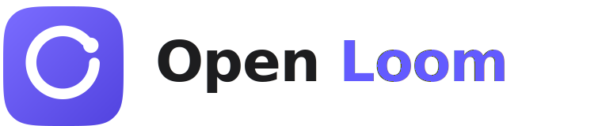
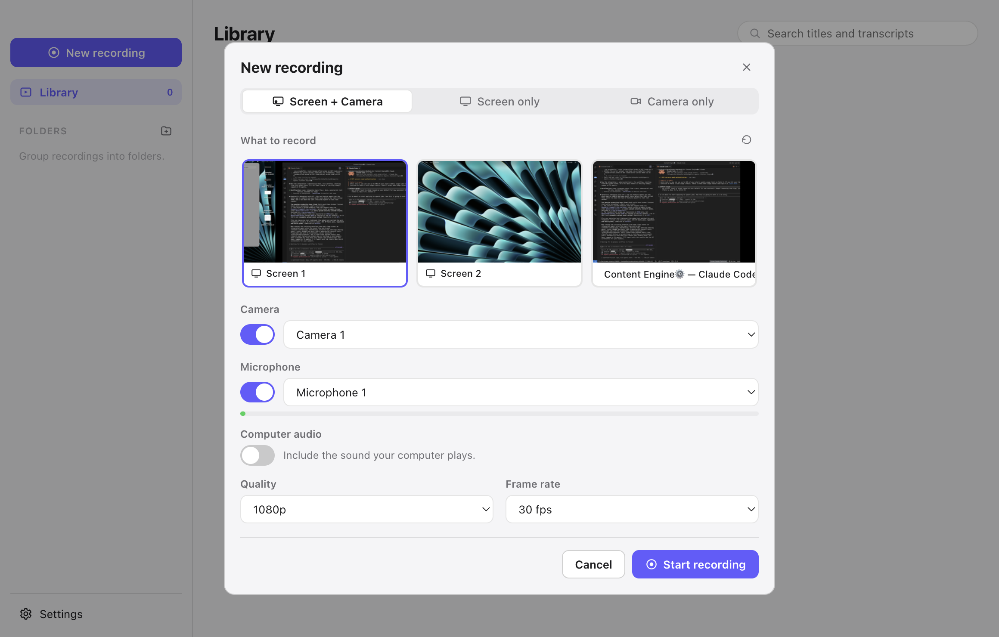
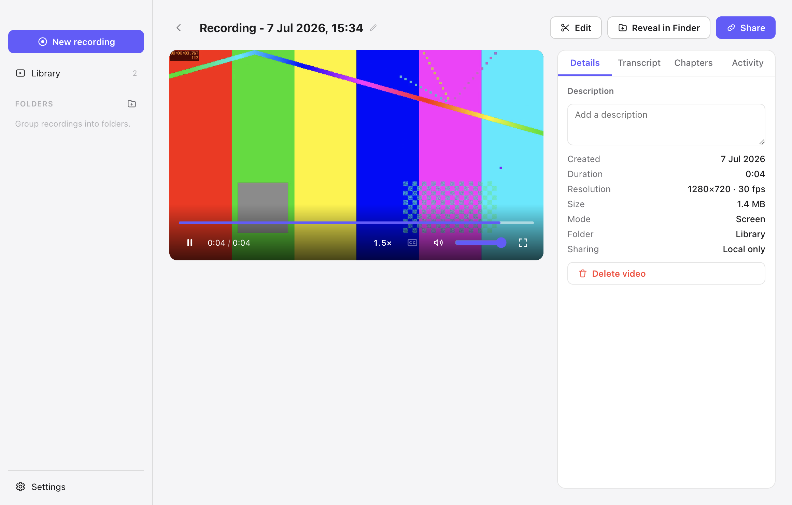
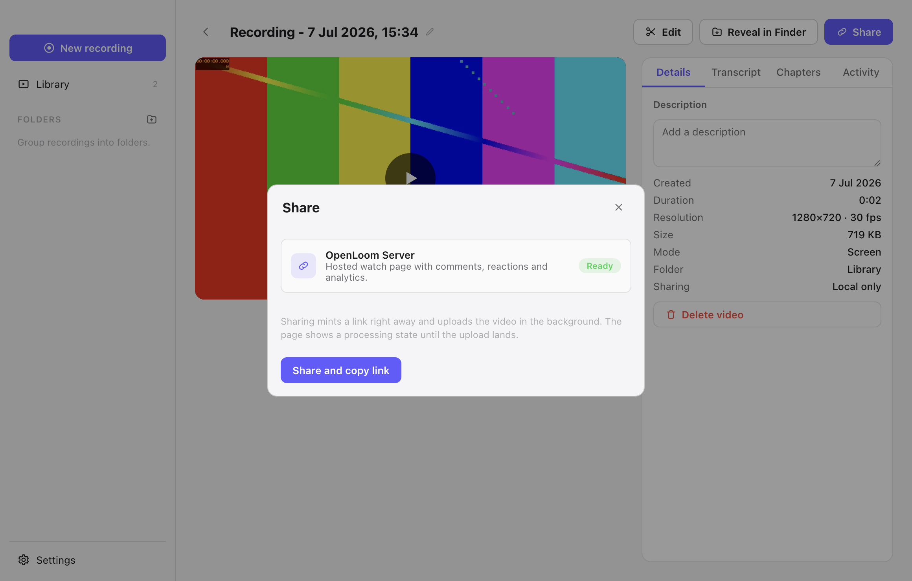
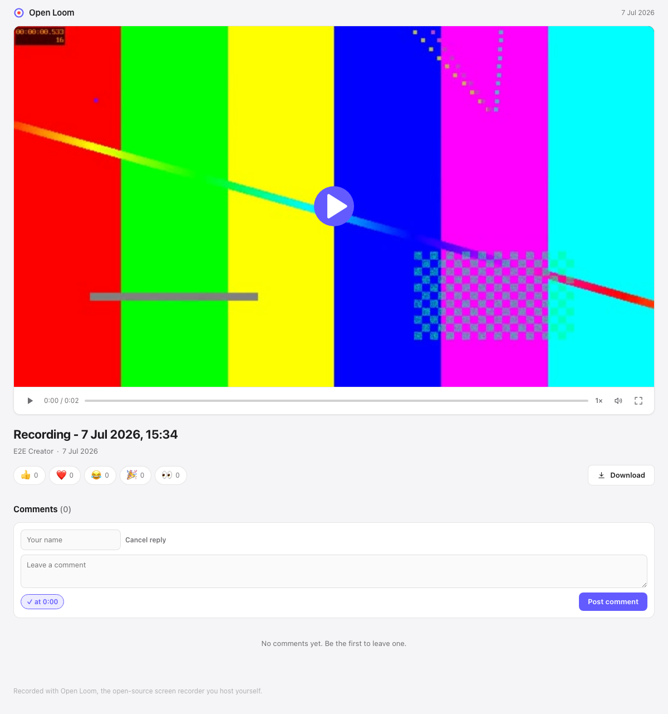

<p align="center">
  
</p>

<h1 align="center">Open Loom</h1>

<p align="center">
  A local-first, open-source screen recorder with Loom-style sharing that runs on storage you own.
</p>

<p align="center">
  <a href="SPEC.md">Specification</a> &middot;
  <a href="FEATURES.md">Feature parity</a> &middot;
  <a href="docs/SHARING.md">Sharing</a> &middot;
  <a href="docs/SELF-HOSTING.md">Self-hosting</a> &middot;
  <a href="CONTRIBUTING.md">Contributing</a>
</p>

<p align="center">
  <a href="https://github.com/jayden9889/open-loom/actions/workflows/ci.yml"></a>
  
  
</p>

---

Record your screen, camera or both. Everything lands as a plain, seekable MP4 in a library on your
own disk. When you want to send a link, share through a share server you run yourself (hosted watch
page with comments, reactions and viewer analytics) or any S3-compatible bucket. No accounts, no
telemetry, no vendor lock. MIT licensed.

<p align="center">
  
  
</p>
<p align="center">
  
  
</p>

## Highlights

- **Three capture modes.** Screen and camera, screen only, or camera only. Pick a whole display or a
  single application window, with live thumbnails.
- **Camera bubble.** Circular, draggable, three sizes, mirror toggle, hide or show mid-recording.
- **System audio.** Native loopback on macOS 14.2 and later, mixed with your microphone. No virtual
  driver.
- **Recording controls.** Countdown, pause and resume, restart, cancel, an on-screen control bar,
  configurable global shortcuts, a drawing tool and optional click highlights.
- **Crash recovery.** An interrupted recording is offered back to you on the next launch.
- **Library.** Thumbnail grid with animated hover previews, folders, and search across titles and
  transcripts. Uncapped, on your disk.
- **Watch and edit.** Custom player with speeds from 0.8x to 2.5x, captions and chapters. Trim, cut
  out middle sections, and stitch clips together.
- **Transcription and AI.** Local whisper.cpp (private and offline) or any OpenAI-compatible
  endpoint. Bring your own key for AI titles, summaries, chapters and action items, including local
  Ollama.
- **Sharing that works instantly.** The share link is minted and copied to your clipboard the moment
  a recording stops; the upload runs in the background. Watch pages carry timestamped comments,
  emoji reactions, viewer analytics, password protection and a call-to-action button.

The full comparison with Loom, feature by feature, is in [FEATURES.md](FEATURES.md).

## Requirements

- Node.js 20 or newer, and npm
- ffmpeg and ffprobe on your PATH. If they are missing, the first-run Setup screen offers a guided
  download of a static build.
- macOS 14.2 or newer for system-audio capture. The rest of the app works on macOS 13 and later.
  Windows and Linux code paths are kept portable but v1 is only tested on macOS.

## Quick start

```bash
git clone https://github.com/jayden9889/open-loom.git
cd open-loom
npm install
npm run dev          # launches Electron with hot reload
```

To produce installers for your platform:

```bash
npm run dist         # builds and packages via electron-builder
```

`npm run dist` writes a dmg and zip on macOS, an NSIS installer on Windows, and AppImage and deb
packages on Linux, into `release/`.

## First run: permissions

The first launch opens a Setup screen that checks four things and gives each a Fix button.

- **Screen Recording (macOS).** Required to capture your screen. macOS shows a system prompt the
  first time; if you miss it, open System Settings, then Privacy and Security, then Screen and System
  Audio Recording, and enable Open Loom. A recording that comes out black almost always means this
  permission is off.
- **Camera.** Only needed for camera and screen-plus-camera modes. The Fix button triggers the macOS
  prompt.
- **Microphone.** Only needed when the mic is on. Same prompt path.
- **ffmpeg.** Needed to turn a raw capture into a seekable MP4. If it is not on your PATH, the Fix
  button downloads a static build into the app's data folder.

You can re-run these checks any time from Settings, then About.

## Choosing where videos are saved

Open Settings, then General, then Save folder, and pick any directory. Every recording is a folder
inside it holding `video.mp4`, a thumbnail, a preview GIF, a transcript and a small `meta.json`.
Move, back up or delete these with ordinary file tools. Reveal in Finder is one click from any video.

## Sharing

Sharing is off by default and every recording stays on your machine. When you want links, choose a
provider in Settings, then Sharing.

### Local only (default)

Nothing leaves your disk. You can still trim, transcribe, and reveal the MP4 to attach it to email or
drop it into any tool by hand.

### Self-hosted share server (two commands)

The `openloom-server` package is a small Hono and SQLite container that delivers the full loop:
hosted watch page, comments, reactions, analytics and password protection.

```bash
cd packages/server
API_KEY=$(openssl rand -base64 24) BASE_URL=https://videos.example.com docker compose up -d
```

Put the printed `API_KEY` and your server URL into Settings, then Sharing, then use Test to confirm
the app can reach it. Full walkthrough, including running behind a reverse proxy and backups, is in
[docs/SELF-HOSTING.md](docs/SELF-HOSTING.md).

### Cloudflare R2 (about five minutes)

Any S3-compatible bucket works. R2 is a good default because egress is free. Create a bucket, add a
public custom domain or dev URL, create an API token, then fill Settings, then Sharing, then S3 with
the endpoint, bucket, keys and public base URL, and press Test. Open Loom uploads the video plus a
self-contained static player page, so the share link is a plain public URL. Step by step in
[docs/SHARING.md](docs/SHARING.md).

## Transcription

Transcription runs locally with whisper.cpp or through any OpenAI-compatible endpoint. To set up the
local engine:

```bash
scripts/setup-whisper.sh
```

This clones and builds whisper.cpp (Metal on macOS) and downloads the `base.en` model. Settings, then
Transcription also has an Install whisper.cpp button that runs the same steps with a live log, or you
can point the two path fields at an existing `whisper-cli` binary and model. Turn on Transcribe
automatically to run it after each recording. Details in [docs/TRANSCRIPTION.md](docs/TRANSCRIPTION.md).

## AI features

AI titles, summaries, chapters and action items are generated from a video's transcript with a
provider you bring yourself. In Settings, then AI, pick Anthropic, an OpenAI-compatible endpoint, or
local Ollama, set the model and key, and press Test connection. Keys are stored encrypted with your
operating system keychain and never leave your machine except to the provider you chose. Ollama needs
no key and keeps everything local.

## Keyboard shortcuts

Global shortcuts work even when Open Loom is hidden, and are editable in Settings, then Shortcuts.

| Action | Default |
|---|---|
| Start or stop recording | Cmd+Shift+L |
| Pause or resume | Alt+Shift+P |
| Cancel recording | Alt+Shift+C |
| Restart recording | Cmd+Shift+R |
| Toggle drawing | Cmd+Shift+D |

In the watch player:

| Action | Key |
|---|---|
| Play or pause | Space |
| Skip 5 seconds | Left / Right |
| Volume | Up / Down |
| Fullscreen | F |
| Captions | C |

## FAQ

**Why not YouTube unlisted as the share backend?** Videos uploaded through an unverified YouTube API
project are locked to private with no appeal, and uploads sit in a small shared daily quota. That
breaks "record, link works instantly" for an installable tool. Open Loom uses storage you own
instead. Full analysis in [docs/SHARING.md](docs/SHARING.md).

**Where are my videos?** In your save folder, as ordinary MP4 files you own. There is no cloud copy
unless you choose a share provider, and even then the original never leaves your disk.

**Do I need a server to use Open Loom?** No. Recording, the library, editing, transcription and AI
all work with sharing set to local only.

**Is anything sent anywhere?** No telemetry, ever. Network requests only happen when you share
(to your own server or bucket) or when you use an AI or transcription endpoint you configured.

## Troubleshooting

- **The recording is black.** macOS Screen Recording permission is off. Open System Settings, then
  Privacy and Security, then Screen and System Audio Recording, enable Open Loom, and restart it.
- **No system audio.** Loopback capture needs macOS 14.2 or newer. On older macOS the toggle is
  disabled with an explanation. Your microphone still records.
- **ffmpeg not found.** Install ffmpeg, or use the Setup screen (or Settings, then About) to download
  a static build.
- **Click highlights say unavailable.** The optional input hook could not load, or Accessibility
  permission is off. The rest of the app is unaffected.

## Scripts

```bash
npm run typecheck    # strict TypeScript across all workspaces
npm test             # vitest unit and integration tests (needs ffmpeg on PATH)
npm run build        # production build (apps/desktop/out)
npm run dist         # package installers via electron-builder
npm run e2e          # Playwright smoke test against the built app
npm run lint         # eslint
npm run make:icons   # regenerate assets/icon.png and tray templates
npm run make:sample  # generate a 5s H.264 sample video for tests
```

Running and testing details are in [docs/TESTING.md](docs/TESTING.md).

## Repo layout

npm workspaces: `apps/desktop` (Electron app, split into main, preload and renderer),
`packages/shared` (types and design tokens), `packages/server` (the self-hosted share server). The
full tree is in [SPEC.md](SPEC.md) section 2.

## Credits and prior art

Open Loom re-implements the Loom product experience openly. No Loom code, assets or branding are
copied. It also stands on the shoulders of earlier open-source recorders as prior art: Cap
(Tauri and Rust, AGPL, source of the instant-share idea), Screenity (a GPL browser extension), and
OpenScreen (MIT, archived). Open Loom is original, MIT-licensed code.

## Licence

MIT. See [LICENSE](LICENSE).
